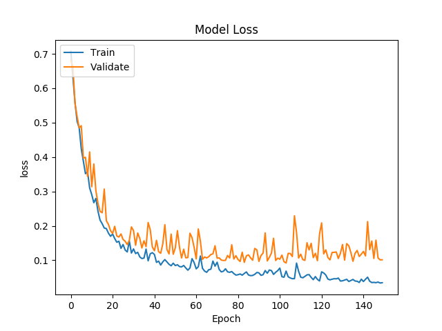

# Peter Moss Acute Myeloid & Lymphoblastic Leukemia AI Research Project

## Acute Lymphoblastic Leukemia Detection System 2020

&nbsp;

# AllDS2020 Classifier

## Introduction

This project is the classifier that is used in Acute the Lymphoblastic Leukemia Detection System 2020. The network provided in this project was originally created in my [ALL research papers evaluation project](https://github.com/leukemiaresearchassociation/ALL-IDB-Classifiers/blob/master/Python/Tensorflow/2-0/Classification/ALL-Papers/Evaluations/Paper-1.md "ALL research papers evaluation project"), where I replicated the network proposed in the [Acute Leukemia Classification Using Convolution Neural Network In Clinical Decision Support System](https://airccj.org/CSCP/vol7/csit77505.pdf "Acute Leukemia Classification Using Convolution Neural Network In Clinical Decision Support System") paper by Thanh.TTP, Giao N. Pham, Jin-Hyeok Park, Kwang-Seok Moon, Suk-Hwan Lee, and Ki-Ryong Kwon, and the data augmentation proposed in  [Leukemia Blood Cell Image Classification Using Convolutional Neural Network](http://www.ijcte.org/vol10/1198-H0012.pdf "Leukemia Blood Cell Image Classification Using Convolutional Neural Network") by T. T. P. Thanh, Caleb Vununu, Sukhrob Atoev, Suk-Hwan Lee, and Ki-Ryong Kwon. The original project was inspired by the [work](https://github.com/AmlResearchProject/AML-ALL-Classifiers/blob/master/Python/_Keras/QuantisedCode/QuantisedCode.ipynb "work") done by [Amita Kapoor](https://www.leukemiaresearchassociation.ai/team/amita-kapoor/profile "Amita Kapoor") and [Taru Jain](https://www.leukemiaresearchassociation.ai/student-program/student/taru-jain "Taru Jain") and my previous [projects](https://github.com/AMLResearchProject/AML-ALL-Classifiers/tree/master/Python/_Keras/AllCNN "projects") based on their work. 

&nbsp;

## Results

| Training | Validation | Test | Accuracy | Recall | Precision | AUC/ROC |
| -------------------- | ----- | ---------- | ---------- | ---------- | ---------- | ---------- |
| 852 |  292 | 20 | 0.9794521 | 0.9794521 | 0.9794521 | 0.9939248 |

&nbsp;

# Network Architecture


_Fig 1. Proposed architecture ([Source](https://airccj.org/CSCP/vol7/csit77505.pdf "Source"))_

In [Acute Leukemia Classification Using Convolution Neural Network In Clinical Decision Support System](https://airccj.org/CSCP/vol7/csit77505.pdf "Acute Leukemia Classification Using Convolution Neural Network In Clinical Decision Support System"), the authors propose a simple 5 layer Convolutional Neural Network. 

In this project we will use an augmented dataset with the network proposed in this paper, built using Tensorflow 2.

We will build a Convolutional Neural Network, as shown in Fig 1, consisting of the following 5 layers (missing out the zero padding layers):

- Conv layer (50x50x30)
- Conv layer (50x50x30)
- Max-Pooling layer (25x25x30)
- Fully Connected layer (2 neurons)
- Softmax layer (Output 2)

&nbsp;

# Getting Started

To get started make sure you completed the steps on the [project home README](https://github.com/AMLResearchProject/ALL-Detection-System-2020 "project home README").

&nbsp;

# Data

Once you have your data you need to add it to the project filesystem. You will notice the data folder in the Model directory, **Model/Data**, inside you have **ALL-IDB-1** & inside there you have **Test**. 

If you are using data augmentation, which this tutorial assumes, first take ten positive and ten negative samples and place them in the **Model/Data/ALL-IDB-1/Test** directory. This will be used by our Oculus Rift application and our testing purposes. In my case I used:

- im006_1.jpg
- im020_1.jpg
- im024_1.jpg
- im026_1.jpg
- im028_1.jpg
- im031_1.jpg
- im035_0.jpg
- im041_0.jpg
- im047_0.jpg
- im053_1.jpg
- im057_1.jpg
- im060_1.jpg
- im063_1.jpg
- im069_0.jpg
- im074_0.jpg
- im088_0.jpg
- im095_0.jpg
- im099_0.jpg
- im101_0.jpg
- im106_0.jpg

Next add the remaining 88 images to the **ALL-IDB-1** folder. The test images used in the demo will not be augmented, which I believe would be the case in a real world scenario.

&nbsp;

# Code structure

The code for this project consists of 4 main Python files and a configuration file:

- [config.json](hhttps://github.com/AMLResearchProject/ALL-Detection-System-2020/Classifier/Model/config.json "config.json"): The configuration file.
- [AllDS2020.py](hhttps://github.com/AMLResearchProject/ALL-Detection-System-2020/Classifier/AllDS2020.py "AllDS2020.py"): Core classifier wrapper class.
- [Helpers.py](hhttps://github.com/AMLResearchProject/ALL-Detection-System-2020/Classifier/Classes/Helpers.py "Helpers.py"): A helper class.
- [Data.py](hhttps://github.com/AMLResearchProject/ALL-Detection-System-2020/Classifier/Classes/Data.py "Data.py"): A data helpers class.
- [Model.py](hhttps://github.com/AMLResearchProject/ALL-Detection-System-2020/Classifier/Classes/Model.py "Model.py"): A model helpers class.

&nbsp;

## Classes 

Our functionality for this network can be found mainly in the **Classes** directory. 

|    Class | Description |
| ------------- | ------------ |
| Helpers.py   | [Helpers.py](hhttps://github.com/AMLResearchProject/ALL-Detection-System-2020/Classifier/Classes/Helpers.py "Helpers.py") is a helper class. The class loads the configuration and logging that the project uses.      |
| Data.py | [Data.py](hhttps://github.com/AMLResearchProject/ALL-Detection-System-2020/Classifier/Classes/Data.py "Data.py") is a data helper class. The class provides the functionality for sorting and preparing your training and validation data.  |     |
| Model.py | [Model.py](hhttps://github.com/AMLResearchProject/ALL-Detection-System-2020/Classifier/Classes/Model.py "Model.py") is a model helper class. The class provides the functionality for creating our CNN.       |

&nbsp;

### Functions

 The main functions are briefly explained below:

|    Class | Function |  Description |
| ------------- | ------------ | -------- |
| Data.py | data_and_labels_sort() | The data_and_labels_sort() function sorts the data into two Python lists, data[] and labels[]. |
| Data.py | data_and_labels_prepare() | The data_and_labels_prepare() function prepares the data and labels for training. |
| Data.py | convert_data() | The convert_data() function converts the training data to a numpy array. |
| Data.py | encode_labels() | The encode_labels() function One Hot Encodes the labels. |
| Data.py | shuffle() | The shuffle() function shuffles the data helping to eliminate bias. |
| Data.py | get_split() | The get_split() function splits the prepared data and labels into traiing and validation data. |
| Model.py | build_network() | The build_network() function creates the network architecture proposed in the [Acute Leukemia Classification Using Convolution Neural Network In Clinical Decision Support System](https://airccj.org/CSCP/vol7/csit77505.pdf "Acute Leukemia Classification Using Convolution Neural Network In Clinical Decision Support System") paper. |
| Model.py | compile_and_train() | The compile_and_train() function compiles and trains the model proposed in the [Acute Leukemia Classification Using Convolution Neural Network In Clinical Decision Support System](https://airccj.org/CSCP/vol7/csit77505.pdf "Acute Leukemia Classification Using Convolution Neural Network In Clinical Decision Support System") paper. |
| Model.py | evaluate_model() | The evaluate_model() function evaluates the model, and displays the values for the metrics we specified. |

&nbsp;

# Configuration

[config.json](hhttps://github.com/AMLResearchProject/ALL-Detection-System-2020/Classifier/Model/config.json "config.json")  holds the configuration for our network. 

```
{
    "cnn": {
        "api": {
            "server": "XXX.XXX.X.XXX",
            "port": 1234
        },
        "model": {
            "model": "Model/model.json",
            "model_aug": "Model/model_augmentation.json",
            "weights": "Model/weights.h5",
            "weights_aug": "Model/weights_augmentation.h5"
        },
        "data": {
            "dim": 50,
            "dim_augmentation": 100,
            "file_type": ".jpg",
            "labels": [0,1],
            "rotations_augmentation": 5,
            "seed_adam": 32,
            "seed_adam_augmentation": 32,
            "seed_rmsprop": 3,
            "seed_rmsprop_augmentation": 6,
            "split": 0.255,
            "split_augmentation": 0.3,
            "test": "Model/Data/ALL-IDB-1/Test",
            "train_dir": "Model/Data/ALL-IDB-1",
            "valid_types": [
              ".JPG",
              ".JPEG",
              ".PNG",
              ".GIF",
              ".jpg",
              ".jpeg",
              ".png",
              ".gif"
            ]
        },
        "train": {
            "batch": 80,
            "batch_augmentation": 100,
            "decay_adam": 1e-6,
            "decay_rmsprop": 1e-6,
            "epochs": 150,
            "epochs_augmentation": 150,
            "learning_rate_adam": 1e-4,
            "learning_rate_rmsprop": 1e-4,
            "val_steps": 10,
            "val_steps_augmentation": 3
        }
    }
}
```

We have the cnn object containing two objects, data and train. In data we have the configuration related to preparing the training and validation data. We use a seed to make sure our results are reproducible. In train we have the configuration related to training the model.

In my case, the configuration above was the best out of my testing, but you may find different configurations work better. Feel free to update these settings to your liking, and please let us know of your experiences.

&nbsp;

# Metrics

We can use metrics to measure the effectiveness of our model. In this network we will use the following metrics:

```
tf.keras.metrics.BinaryAccuracy(name='accuracy'),
tf.keras.metrics.Precision(name='precision'),
tf.keras.metrics.Recall(name='recall'),
tf.keras.metrics.AUC(name='auc')
```

These metrics will be displayed and plotted once our model is trained.  A useful tutorial while working on the metrics was the [Classification on imbalanced data](https://www.tensorflow.org/tutorials/structured_data/imbalanced_data) tutorial on Tensorflow's website.

&nbsp;

# Training the model

Now you are ready to train your model. As mentioned above, I used an Ubuntu machine with an NVIDIA GTX 1050 ti, using different machines/GPU/CPU may vary the results, if so please let us know your findings.

## Start The Training

Ensuring you have completed all previous steps, you can start training using the following command. 

```
python3 AllDS2020.py Train Adam  True
```

This tells the classifier to start in Train mode, use the Adam optimizer, and to to use data augmentation. You can play around and use rmsprop optimizer and no data augmentation etc, but for this tutorial the above is the command to use.

### Data

First the data will be prepared.

```
2020-03-05 21:03:35,817 - Data - INFO - All data: 88
2020-03-05 21:03:35,817 - Data - INFO - Positive data: 39
2020-03-05 21:03:35,817 - Data - INFO - Negative data: 49
2020-03-05 21:03:40,155 - Data - INFO - Data shape: (1144, 100, 100, 3)
2020-03-05 21:03:40,157 - Data - INFO - Labels shape: (1144, 2)
2020-03-05 21:03:40,157 - Data - INFO - Augmented data: (1144, 100, 100, 3)
2020-03-05 21:03:40,157 - Data - INFO - All Labels: (1144, 2)
2020-03-05 21:03:40,684 - Data - INFO - Training data: (852, 100, 100, 3)
2020-03-05 21:03:40,684 - Data - INFO - Training labels: (852, 2)
2020-03-05 21:03:40,684 - Data - INFO - Validation data: (292, 100, 100, 3)
2020-03-05 21:03:40,684 - Data - INFO - Validation labels: (292, 2)
```

### Model Summary

Our network matches the architecture proposed in the paper exactly, with exception to maybe the optimizer and loss function as this info was not provided in the paper. 

Before the model begins training, we will be shown the model summary, or architecture. 

```
Model: "AllCnn"
_________________________________________________________________
Layer (type)                 Output Shape              Param #   
=================================================================
zero_padding2d (ZeroPadding2 (None, 104, 104, 3)       0         
_________________________________________________________________
conv2d (Conv2D)              (None, 100, 100, 30)      2280      
_________________________________________________________________
zero_padding2d_1 (ZeroPaddin (None, 104, 104, 30)      0         
_________________________________________________________________
conv2d_1 (Conv2D)            (None, 100, 100, 30)      22530     
_________________________________________________________________
max_pooling2d (MaxPooling2D) (None, 50, 50, 30)        0         
_________________________________________________________________
flatten (Flatten)            (None, 75000)             0         
_________________________________________________________________
dense (Dense)                (None, 2)                 150002    
_________________________________________________________________
activation (Activation)      (None, 2)                 0         
=================================================================
Total params: 174,812
Trainable params: 174,812
Non-trainable params: 0

Train on 852 samples, validate on 292 samples
```

## Training Results

Below are the training results for 150 epochs.


_Fig 2. Ubuntu/GTX 1050 ti Accuracy_



_Fig 3. Ubuntu/GTX 1050 ti Loss_


_Fig 4. Ubuntu/GTX 1050 ti Precision_


_Fig 5. Ubuntu/GTX 1050 ti Recall_


_Fig 6. Ubuntu/GTX 1050 ti AUC_

```
2020-03-05 21:09:05,268 - Model - INFO - Metrics: loss 0.10147356269370815
2020-03-05 21:09:05,268 - Model - INFO - Metrics: acc 0.9794521
2020-03-05 21:09:05,268 - Model - INFO - Metrics: precision 0.9794521
2020-03-05 21:09:05,268 - Model - INFO - Metrics: recall 0.9794521
2020-03-05 21:09:05,268 - Model - INFO - Metrics: auc 0.9939248

2020-03-05 21:09:12,757 - Model - INFO - Confusion Matrix: [[160   0]
 [  6 126]]

2020-03-05 21:09:15,365 - Model - INFO - True Positives: 126(43.15068493150685%)
2020-03-05 21:09:15,365 - Model - INFO - False Positives: 0(0.0%)
2020-03-05 21:09:15,365 - Model - INFO - True Negatives: 160(54.794520547945204%)
2020-03-05 21:09:15,365 - Model - INFO - False Negatives: 6(2.0547945205479454%)
2020-03-05 21:09:15,365 - Model - INFO - Specificity: 1.0
2020-03-05 21:09:15,365 - Model - INFO - Misclassification: 6(2.0547945205479454%)
```

| Accuracy | Recall | Precision | AUC/ROC |
| ---------- | ---------- | ---------- | ---------- |
| 0.9794521 | 0.9794521 | 0.9794521 | 0.9939248 |

## Overall Results

| Figures of merit     | Amount/Value | Percentage |
| -------------------- | ----- | ---------- |
| True Positives       | 126 | 43.15068493150685% |
| False Positives      | 0 | 0.0% |
| True Negatives       | 160 | 54.794520547945204% |
| False Negatives      | 6 | 2.0547945205479454% |
| Misclassification    | 6 | 2.0547945205479454% |
| Sensitivity / Recall | 0.9794521   | 0.98% |
| Specificity          | 1.0  | 100% |

&nbsp;

# Local Testing

Now we will use the test data to see how the classifier reacts to our testing data. Real world testing is the most important testing, as it allows you to see the how the model performs in a real world environment. 

This part of the system will use the test data from the **Model/Data/ALL-IDB-1/Test** directory. The command to start testing locally is as follows:

```
python3 AllDS2020.py Classify Adam  True
```

## Output/Results

```
2020-03-05 20:56:17,227 - Model - INFO - Loaded test image Model/Data/ALL-IDB-1/Test/Im060_1.jpg
2020-03-05 20:56:18,048 - Model - INFO - ALL correctly detected (True Positive)
2020-03-05 20:56:18,122 - Model - INFO - Loaded test image Model/Data/ALL-IDB-1/Test/Im047_0.jpg
2020-03-05 20:56:18,125 - Model - INFO - ALL correctly not detected (True Negative)
2020-03-05 20:56:18,197 - Model - INFO - Loaded test image Model/Data/ALL-IDB-1/Test/Im057_1.jpg
2020-03-05 20:56:18,201 - Model - INFO - ALL correctly detected (True Positive)
2020-03-05 20:56:18,230 - Model - INFO - Loaded test image Model/Data/ALL-IDB-1/Test/Im026_1.jpg
2020-03-05 20:56:18,233 - Model - INFO - ALL correctly detected (True Positive)
2020-03-05 20:56:18,297 - Model - INFO - Loaded test image Model/Data/ALL-IDB-1/Test/Im041_0.jpg
2020-03-05 20:56:18,301 - Model - INFO - ALL correctly not detected (True Negative)
2020-03-05 20:56:18,329 - Model - INFO - Loaded test image Model/Data/ALL-IDB-1/Test/Im020_1.jpg
2020-03-05 20:56:18,332 - Model - INFO - ALL correctly detected (True Positive)
2020-03-05 20:56:18,396 - Model - INFO - Loaded test image Model/Data/ALL-IDB-1/Test/Im053_1.jpg
2020-03-05 20:56:18,400 - Model - INFO - ALL correctly detected (True Positive)
2020-03-05 20:56:18,462 - Model - INFO - Loaded test image Model/Data/ALL-IDB-1/Test/Im101_0.jpg
2020-03-05 20:56:18,466 - Model - INFO - ALL correctly not detected (True Negative)
2020-03-05 20:56:18,498 - Model - INFO - Loaded test image Model/Data/ALL-IDB-1/Test/Im028_1.jpg
2020-03-05 20:56:18,502 - Model - INFO - ALL correctly detected (True Positive)
2020-03-05 20:56:18,566 - Model - INFO - Loaded test image Model/Data/ALL-IDB-1/Test/Im069_0.jpg
2020-03-05 20:56:18,570 - Model - INFO - ALL correctly not detected (True Negative)
2020-03-05 20:56:18,629 - Model - INFO - Loaded test image Model/Data/ALL-IDB-1/Test/Im095_0.jpg
2020-03-05 20:56:18,633 - Model - INFO - ALL incorrectly detected (False Positive)
2020-03-05 20:56:18,665 - Model - INFO - Loaded test image Model/Data/ALL-IDB-1/Test/Im024_1.jpg
2020-03-05 20:56:18,668 - Model - INFO - ALL correctly detected (True Positive)
2020-03-05 20:56:18,736 - Model - INFO - Loaded test image Model/Data/ALL-IDB-1/Test/Im088_0.jpg
2020-03-05 20:56:18,740 - Model - INFO - ALL incorrectly detected (False Positive)
2020-03-05 20:56:18,807 - Model - INFO - Loaded test image Model/Data/ALL-IDB-1/Test/Im035_0.jpg
2020-03-05 20:56:18,811 - Model - INFO - ALL correctly not detected (True Negative)
2020-03-05 20:56:18,842 - Model - INFO - Loaded test image Model/Data/ALL-IDB-1/Test/Im006_1.jpg
2020-03-05 20:56:18,845 - Model - INFO - ALL correctly detected (True Positive)
2020-03-05 20:56:18,910 - Model - INFO - Loaded test image Model/Data/ALL-IDB-1/Test/Im074_0.jpg
2020-03-05 20:56:18,914 - Model - INFO - ALL correctly not detected (True Negative)
2020-03-05 20:56:18,975 - Model - INFO - Loaded test image Model/Data/ALL-IDB-1/Test/Im099_0.jpg
2020-03-05 20:56:18,980 - Model - INFO - ALL correctly not detected (True Negative)
2020-03-05 20:56:19,045 - Model - INFO - Loaded test image Model/Data/ALL-IDB-1/Test/Im063_1.jpg
2020-03-05 20:56:19,049 - Model - INFO - ALL correctly detected (True Positive)
2020-03-05 20:56:19,110 - Model - INFO - Loaded test image Model/Data/ALL-IDB-1/Test/Im106_0.jpg
2020-03-05 20:56:19,114 - Model - INFO - ALL correctly not detected (True Negative)
2020-03-05 20:56:19,141 - Model - INFO - Loaded test image Model/Data/ALL-IDB-1/Test/Im031_1.jpg
2020-03-05 20:56:19,144 - Model - INFO - ALL incorrectly not detected (False Negative)
2020-03-05 20:56:19,145 - Model - INFO - Images Classifier: 20
2020-03-05 20:56:19,145 - Model - INFO - True Positives: 9
2020-03-05 20:56:19,145 - Model - INFO - False Positives: 2
2020-03-05 20:56:19,145 - Model - INFO - True Negatives: 8
2020-03-05 20:56:19,145 - Model - INFO - False Negatives: 1
```

&nbsp;

# Server Testing

Now we will use the test data to see how the server classifier reacts.

This part of the system will use the test data from the **Model/Data/ALL-IDB-1/Test** directory. 

You need to open two terminal windows or tabs, in the first, use the following command to start the server:

```
python3 AllDS2020.py Server Adam  True
```

In your second terminal, use the following command:

```
python3 AllDS2020.py Client Adam  True
```

## Output/Results

```
2020-03-05 23:44:00,128 - Model - INFO - Sending request for: Model/Data/ALL-IDB-1/Test/Im060_1.jpg
2020-03-05 23:44:01,199 - Model - INFO - ALL correctly detected (True Positive)

2020-03-05 23:44:08,206 - Model - INFO - Sending request for: Model/Data/ALL-IDB-1/Test/Im047_0.jpg
2020-03-05 23:44:08,555 - Model - INFO - ALL correctly not detected (True Negative)

2020-03-05 23:44:15,562 - Model - INFO - Sending request for: Model/Data/ALL-IDB-1/Test/Im057_1.jpg
2020-03-05 23:44:15,908 - Model - INFO - ALL correctly detected (True Positive)

2020-03-05 23:44:22,910 - Model - INFO - Sending request for: Model/Data/ALL-IDB-1/Test/Im026_1.jpg
2020-03-05 23:44:23,067 - Model - INFO - ALL correctly detected (True Positive)

2020-03-05 23:44:30,074 - Model - INFO - Sending request for: Model/Data/ALL-IDB-1/Test/Im041_0.jpg
2020-03-05 23:44:30,405 - Model - INFO - ALL correctly not detected (True Negative)

2020-03-05 23:44:37,411 - Model - INFO - Sending request for: Model/Data/ALL-IDB-1/Test/Im020_1.jpg
2020-03-05 23:44:37,602 - Model - INFO - ALL correctly detected (True Positive)

2020-03-05 23:44:44,610 - Model - INFO - Sending request for: Model/Data/ALL-IDB-1/Test/Im053_1.jpg
2020-03-05 23:44:44,958 - Model - INFO - ALL correctly detected (True Positive)

2020-03-05 23:44:51,965 - Model - INFO - Sending request for: Model/Data/ALL-IDB-1/Test/Im101_0.jpg
2020-03-05 23:44:52,339 - Model - INFO - ALL correctly not detected (True Negative)

2020-03-05 23:44:59,346 - Model - INFO - Sending request for: Model/Data/ALL-IDB-1/Test/Im028_1.jpg
2020-03-05 23:44:59,534 - Model - INFO - ALL correctly detected (True Positive)

2020-03-05 23:45:06,538 - Model - INFO - Sending request for: Model/Data/ALL-IDB-1/Test/Im069_0.jpg
2020-03-05 23:45:06,898 - Model - INFO - ALL correctly not detected (True Negative)

2020-03-05 23:45:13,902 - Model - INFO - Sending request for: Model/Data/ALL-IDB-1/Test/Im095_0.jpg
2020-03-05 23:45:14,260 - Model - INFO - ALL incorrectly detected (False Positive)

2020-03-05 23:45:21,266 - Model - INFO - Sending request for: Model/Data/ALL-IDB-1/Test/Im024_1.jpg
2020-03-05 23:45:21,427 - Model - INFO - ALL correctly detected (True Positive)

2020-03-05 23:45:28,435 - Model - INFO - Sending request for: Model/Data/ALL-IDB-1/Test/Im088_0.jpg
2020-03-05 23:45:28,815 - Model - INFO - ALL incorrectly detected (False Positive)

2020-03-05 23:45:35,822 - Model - INFO - Sending request for: Model/Data/ALL-IDB-1/Test/Im035_0.jpg
2020-03-05 23:45:36,165 - Model - INFO - ALL correctly not detected (True Negative)

2020-03-05 23:45:43,173 - Model - INFO - Sending request for: Model/Data/ALL-IDB-1/Test/Im006_1.jpg
2020-03-05 23:45:43,336 - Model - INFO - ALL correctly detected (True Positive)

2020-03-05 23:45:50,342 - Model - INFO - Sending request for: Model/Data/ALL-IDB-1/Test/Im074_0.jpg
2020-03-05 23:45:50,673 - Model - INFO - ALL incorrectly detected (False Positive)

2020-03-05 23:45:57,678 - Model - INFO - Sending request for: Model/Data/ALL-IDB-1/Test/Im099_0.jpg
2020-03-05 23:45:58,062 - Model - INFO - ALL correctly not detected (True Negative)

2020-03-05 23:46:05,066 - Model - INFO - Sending request for: Model/Data/ALL-IDB-1/Test/Im063_1.jpg
2020-03-05 23:46:05,401 - Model - INFO - ALL correctly detected (True Positive)

2020-03-05 23:46:12,404 - Model - INFO - Sending request for: Model/Data/ALL-IDB-1/Test/Im106_0.jpg
2020-03-05 23:46:12,734 - Model - INFO - ALL correctly not detected (True Negative)

2020-03-05 23:46:19,738 - Model - INFO - Sending request for: Model/Data/ALL-IDB-1/Test/Im031_1.jpg
2020-03-05 23:46:19,932 - Model - INFO - ALL incorrectly not detected (False Negative)

2020-03-05 23:46:26,938 - Model - INFO - Images Classifier: 20
2020-03-05 23:46:26,938 - Model - INFO - True Positives: 9
2020-03-05 23:46:26,939 - Model - INFO - False Positives: 3
2020-03-05 23:46:26,939 - Model - INFO - True Negatives: 7
2020-03-05 23:46:26,939 - Model - INFO - False Negatives: 1
```

# Contributing

The Peter Moss Acute Myeloid & Lymphoblastic Leukemia AI Research project encourages and welcomes code contributions, bug fixes and enhancements from the Github.

Please read the [CONTRIBUTING](https://github.com/AMLResearchProject/ALL-Detection-System-2020/blob/master/CONTRIBUTING.md "CONTRIBUTING") document for a full guide to forking our repositories and submitting your pull requests. You will also find information about our code of conduct on this page.

## Contributors

- [Adam Milton-Barker](https://www.leukemiaresearchassociation.ai/ "Adam Milton-Barker") - [Peter Moss Leukemia AI Research](https://www.leukemiaresearchassociation.ai "Peter Moss Leukemia AI Research") & Intel Software Innovator, Sabadell, Spain

&nbsp;

# Versioning

We use SemVer for versioning. For the versions available, see [Releases](https://github.com/AMLResearchProject/ALL-Detection-System-2020/releases "Releases").

# License

This project is licensed under the **MIT License** - see the [LICENSE](https://github.com/AMLResearchProject/ALL-Detection-System-2020/blob/master/LICENSE "LICENSE") file for details.

# Bugs/Issues

We use the [repo issues](https://github.com/AMLResearchProject/ALL-Detection-System-2020/issues "repo issues") to track bugs and general requests related to using this project. See [CONTRIBUTING](https://github.com/AMLResearchProject/ALL-Detection-System-2020/blob/master/CONTRIBUTING.md "CONTRIBUTING") for more info on how to submit bugs, feature requests and proposals.
