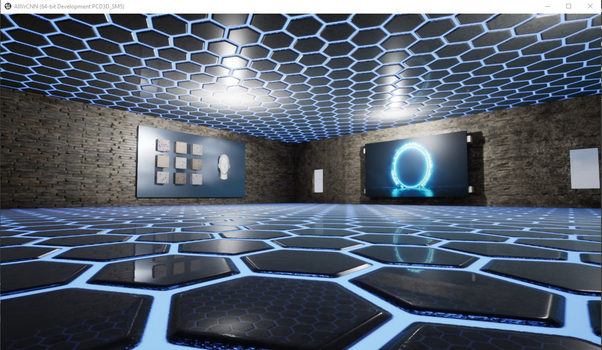

# Peter Moss Acute Myeloid & Lymphoblastic Leukemia AI Research Project

## Acute Lymphoblastic Leukemia Detection System 2020

[](https://github.com/AMLResearchProject/ALL-Detection-System-2020/tree/0.0.1)



Acute Lymphoblastic Leukemia Detection System 2020 uses Tensorflow 2 & Oculus Rift to provide a virtual diagnosis system.

This project is made up of a number of components which work together as a network to make the system work. Follow the completed tutorials below in the provided order. The classifiers can be run indvidually but a full system setup requires the [Tensorflow 2.0 Classifier](https://github.com/AMLResearchProject/ALL-Detection-System-2020/tree/master/Classifier "Tensorflow 2.0 Classifier"), and [Chatbot](https://github.com/AMLResearchProject/ALL-Detection-System-2020/tree/master/Chatbot "Chatbot") tutorials to be completed.

&nbsp;

# Network Architecture


_Fig 1. Proposed architecture ([Source](https://airccj.org/CSCP/vol7/csit77505.pdf "Source"))_

In [Acute Leukemia Classification Using Convolution Neural Network In Clinical Decision Support System](https://airccj.org/CSCP/vol7/csit77505.pdf "Acute Leukemia Classification Using Convolution Neural Network In Clinical Decision Support System"), the authors propose a simple 5 layer Convolutional Neural Network. 

> "In this work, we proposed a network contains 4 layers. The first 3 layers for detecting features
> and the other two layers (Fully connected and Softmax) are for classifying the features. The input
> image has the size [50x50x3]. The receptive field (or the filter size) is 5x5. The stride is 1 then we move the filters one pixel at a time. The zero-padding is 2. It will allow us to control the spatial
> size of the output image (we will use it to exactly preserve the spatial size of the input volume so
> the input and output width and height are the same). During the experiment, we found that in our
> case, altering the size of original image during the convolution lead to decrease the accuracy
> about 40%. Thus the output image after convolution layer 1 has the same size with the input
> image."

> "The convolution layer 2 has the same structure with the convolution layer 1. The filter size is 5x5,
> the stride is 1 and the zero-padding is 2. The number of feature maps (the channel or the depth) in
> our case is 30. If the number of feature maps is lower or higher than 30, the accuracy will
> decrease 50%. By experiment, we found the accuracy also decrease 50% if we remove
> Convolution layer 2.""

> "The Max-Pooling layer 25x25 has Filter size is 2 and stride is 2. The fully connected layer has 2
> neural. Finally, we use the Softmax layer for the classification. "

In this project we will use an augmented dataset with the network proposed in this paper, built using Tensorflow 2.

&nbsp;

# Getting Started 

To get started there are some things you need to collect:

## Hardware

In this project I used a NVIDIA GTX 1050 ti with Ubuntu 18.04. I will check this code in Windows soon on a GTX 1080 ti.

## Software

In this project I used Python 3, tensorflow-gpu (2.0). In previous testing I have found differences in the results when using/not using GPU, feel free to let us know of any issues. 

All other requirements should be included in Setup.sh you can run this file by navigating to the Classifiers directory in terminal and using the code below:

```
sh Setup.sh
```

## ALL-IDB

You need to be granted access to use the Acute Lymphoblastic Leukemia Image Database for Image Processing dataset. You can find the application form and information about getting access to the dataset on [this page](https://homes.di.unimi.it/scotti/all/#download) as well as information on how to contribute back to the project [here](https://homes.di.unimi.it/scotti/all/results.php). If you are not able to obtain a copy of the dataset please feel free to try this tutorial on your own dataset, we would be very happy to find additional AML & ALL datasets.

### ALL_IDB1 

In this project, [ALL-IDB1](https://homes.di.unimi.it/scotti/all/#datasets) is used, one of the datsets from the Acute Lymphoblastic Leukemia Image Database for Image Processing dataset. We will use data augmentation to increase the amount of training and testing data we have.

"The ALL_IDB1 version 1.0 can be used both for testing segmentation capability of algorithms, as well as the classification systems and image preprocessing methods. This dataset is composed of 108 images collected during September, 2005. It contains about 39000 blood elements, where the lymphocytes has been labeled by expert oncologists. The images are taken with different magnifications of the microscope ranging from 300 to 500."  

&nbsp;

# Build Your Acute Lymphoblastic Leukemia Detection System 2020

Follow the guides below to build your Virtual Reality Acute Lymphoblastic Leukemia Detection System.

| Project                                                                                                                                                                                                                                                                                                                                                                      | Description                                                                                                                         | Status      |
| ---------------------------------------------------------------------------------------------------------------------------------------------------------------------------------------------------------------------------------------------------------------------------------------------------------------------------------------------------------------------------- | ----------------------------------------------------------------------------------------------------------------------------------- | ----------- |
| [Tensorflow 2.0 Classifier](https://github.com/AMLResearchProject/ALL-Detection-System-2020/tree/master/Classifier "Tensorflow 2.0 Classifier") | Applies filters to the original dataset and increases the amount of training / test data. Provides code for training a CNN for detecting ALL. Hosts a REST API endpoint that provides access to the model for inference. | Development    |
| [Chatbot](https://github.com/AMLResearchProject/ALL-Detection-System-2020/tree/master/Chatbot "Chatbot")                                                                                                                                                                                                                                                             | Hosts a REST API with access to the Natural Language Understanding Engine trained with basic knowledge of AML.                      | Development    |
| [Virtual Reality (Oculus Rift)](https://github.com/AMLResearchProject/ALL-Detection-System-2020/tree/master/Virtual-Reality "Oculus Rift")                                                                                                                                                                                                                                                             | A virtual room made with Unreal Engine 4. In the room the ALL data is displayed as blocks and the user can point at those blocks to classify the image.                      | Development    |

&nbsp;


# Contributing

The Peter Moss Acute Myeloid & Lymphoblastic Leukemia AI Research project encourages and welcomes code contributions, bug fixes and enhancements from the Github.

Please read the [CONTRIBUTING](https://github.com/AMLResearchProject/ALL-Detection-System-2020/blob/master/CONTRIBUTING.md "CONTRIBUTING") document for a full guide to forking our repositories and submitting your pull requests. You will also find information about our code of conduct on this page.

## Contributors

- [Adam Milton-Barker](https://www.leukemiaresearchassociation.ai/ "Adam Milton-Barker") - [Peter Moss Leukemia AI Research](https://www.leukemiaresearchassociation.ai "Peter Moss Leukemia AI Researchr") & Intel Software Innovator, Barcelona, Spain

&nbsp;

# Versioning

We use SemVer for versioning. For the versions available, see [Releases](https://github.com/AMLResearchProject/ALL-Detection-System-2020/releases "Releases").

# License

This project is licensed under the **MIT License** - see the [LICENSE](https://github.com/AMLResearchProject/ALL-Detection-System-2020/blob/master/LICENSE "LICENSE") file for details.

# Bugs/Issues

We use the [repo issues](https://github.com/AMLResearchProject/ALL-Detection-System-2020/issues "repo issues") to track bugs and general requests related to using this project. See [CONTRIBUTING](https://github.com/AMLResearchProject/ALL-Detection-System-2020/blob/master/CONTRIBUTING.md "CONTRIBUTING") for more info on how to submit bugs, feature requests and proposals.
